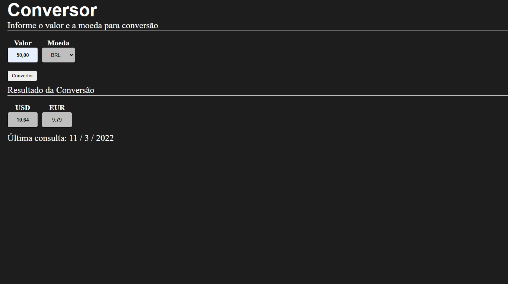

# Conversor

<strong>Com este sistema é possivel fazer a cotação das principais moedas do mercado, Euro, Real e Dólar. Basta colocar o valor e escolher a moeda.</strong>

 
 
<strong>Version: 1.0</strong>

## Para rodar o projeto
* Clonar o Repositório.
* Abrir o CMD.
* Ir até o repositório clonado.
* e digitar um dos comandos abaixo:
  * **npm start** (Inicia o App)

## Images
  

## Tecnologias
 * ReactJS
 * Javascript
 * HTML
 * Styled Components
 * Axios
 * AwesomeAPI

## Status
 **In progress...**

## Author
 **Lucas Vieira**   
 
 
